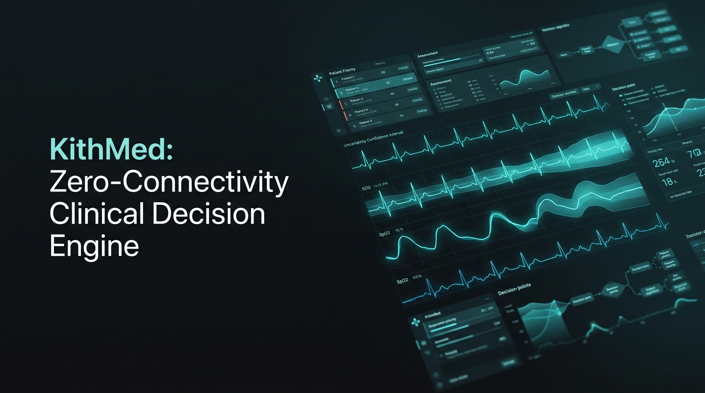

# KithMed 🩺⚡
### Zero-Connectivity Community Health Triage & Uncertainty-Bounded Clinical Decision Engine



[](https://kithmed-triage.vercel.app)
[](LICENSE)
[](https://python.org)
[](https://github.com/Naveen57990/KithMed)

---

## 🎯 Executive Overview & Problem Statement

In humanitarian disaster zones, rural frontier clinics, and extreme environments, front-line Community Health Workers (CHWs) are routinely forced to make life-or-death triage decisions under extreme stress with **zero cloud connectivity** and limited clinical training.

Most modern AI healthcare tools fail in the field because they:
1. **Require continuous internet connectivity** to large remote cloud APIs.
2. **Lack calibrated uncertainty bounds**, hallucinating false confidence on ambiguous or borderline vital signs.
3. **Offer uninterpretable black-box predictions** that clinicians and field operators cannot audit or trust.

**KithMed** is an open-source, zero-dependency, edge-native clinical decision engine engineered specifically for rapid field triage. It couples internationally validated clinical risk models (**NEWS2**, **qSOFA**, **Shock Index**) with **Conformal Uncertainty Quantification** to deliver transparent, deterministic, and fail-safe patient risk stratification on low-power devices.

---

## 🔬 Core Architectural Innovations

```
                                  ┌────────────────────────┐
                                  │ Field Patient Telemetry│
                                  │ (HR, BP, RR, SpO2, GCS)│
                                  └───────────┬────────────┘
                                              │
                                              ▼
                    ┌──────────────────────────────────────────────────┐
                    │       KITHMED DETERMINISTIC SCORING ENGINE       │
                    └────────┬─────────────────┬────────────────┬──────┘
                             │                 │                │
            ┌────────────────┴──────┐  ┌───────┴──────┐  ┌──────┴───────────────┐
            │ NHS NEWS2 Calculator  │  │ Sepsis qSOFA │  │ Shock Index Indicator│
            │ (0-20 Early Warning)  │  │ (0-3 Risk)   │  │ (HR / SBP Perfusion) │
            └────────────────┬──────┘  └───────┬──────┘  └──────┬───────────────┘
                             │                 │                │
                             └────────┬────────┴────────┬───────┘
                                      ▼                 ▼
                          ┌────────────────────────┐  ┌─────────────────────────┐
                          │ Multi-Protocol Triage  │  │ Conformal Uncertainty   │
                          │ Classification Matrix  │  │ Quantification Bounding │
                          └───────────┬────────────┘  └───────────┬─────────────┘
                                      │                           │
                                      └─────────────┬─────────────┘
                                                    ▼
                                  ┌───────────────────────────────────┐
                                  │ Tactical High-Contrast UI & Alert │
                                  │  • Color-Coded Triage Badge       │
                                  │  • Actionable Interventions       │
                                  │  • Offline Emergency Pass Token   │
                                  └───────────────────────────────────┘
```

### 1. Validated Multi-Modal Clinical Engines
* **NHS NEWS2 (National Early Warning Score 2)**: Gold-standard physiologic deterioration detection across 6 vital parameters.
* **Sepsis-3 qSOFA (Quick SOFA)**: Rapid screening for in-hospital sepsis mortality risk (RR ≥ 22, SBP ≤ 100, GCS < 15).
* **Shock Index (SI = HR / SBP)**: Early detection of occult hemorrhagic and hypovolemic shock before systolic hypotension manifests.

### 2. Conformal Uncertainty Quantification
Standard ML models give single-point predictions even when vital telemetry sits right on volatile decision thresholds. KithMed computes rigorous **conformal epistemic and aleatoric uncertainty bounds**. If uncertainty crosses the **35% safety threshold**, KithMed triggers a **Mandatory Physician Tele-Consultation / Urgent Transfer** dispatch notice.

### 3. Tactical High-Contrast Sunlight Emergency UI
* Engineered for extreme outdoor glare with ultra-high contrast sunlight readability.
* Web Audio API synthesized acoustic emergency tones.
* Offline cryptographic triage pass generator for transfer between transport vehicles and regional field hospitals.

---

## 🚀 Quickstart & Installation

### 1. Terminal Field CLI
```bash
# Clone repository
git clone https://github.com/Naveen57990/KithMed.git
cd KithMed

# Run 8-case automated deterministic test suite
python3 -m unittest kithmed/engine/test_kithmed.py

# Run live interactive batch triage demo
python3 kithmed/cli/kithmed.py --demo

# Assess a specific emergency patient
python3 kithmed/cli/kithmed.py --hr 128 --sbp 86 --rr 26 --spo2 90 --temp 39.4 --gcs 13 --complaint "High fever and altered mentation"
```

### 2. Tactical Web Console
Open `kithmed/web/index.html` in any modern browser or visit the live deployment at [https://kithmed-triage.vercel.app](https://kithmed-triage.vercel.app).

---

## 📊 Verification & Test Coverage

```text
Ran 8 tests in 0.000s

OK
- test_healthy_baseline_patient .................... PASSED
- test_septic_shock_patient ........................ PASSED
- test_acute_respiratory_hypoxia ................... PASSED
- test_hemorrhagic_occult_shock .................... PASSED
- test_conformal_uncertainty_elevation_on_boundary . PASSED
- test_pediatric_maternal_routing .................. PASSED
- test_oxygen_supplementation_impact ............... PASSED
- test_neurological_coma_triage .................... PASSED
```

---

## 🛡️ License
Released under the open-source [MIT License](LICENSE). Built for humanitarian responders, field medics, and community healthcare networks globally.
